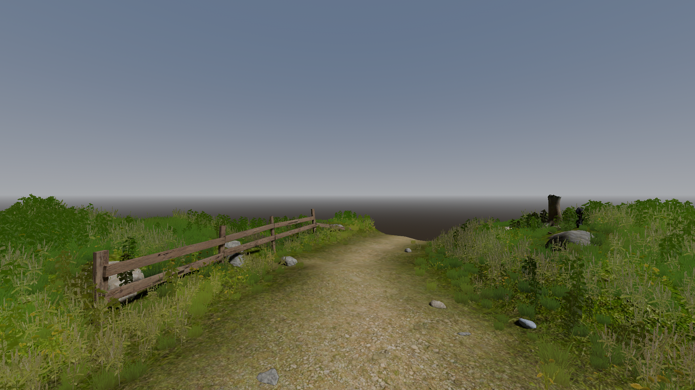
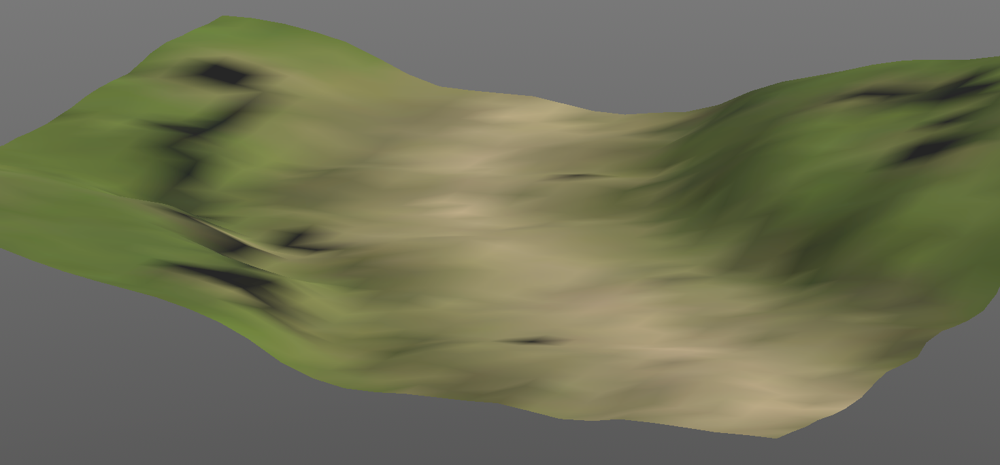

# Godot Mobile-Optimized Grass Plugin

A 3D grass instancing plugin designed for mobile GPUs

Grass (and other ground cover vegetation) is yet another challenge in 3D graphics, especially on mobile platforms. A common approach is to take a simple cluster of intersecting grass cards and have the GPU draw hundreds or thousands of instances of the mesh. While this is efficient on desktop systems, alpha blending the overlapping triangles will lead to massive amounts of overdraw, killing mobile performance.

Alpha test (a.k.a. alpha scissor) is a cheaper option but it creates ugly aliasing, especially with distant objects and aggressive LOD. At great distances, the mesh will actually start to disappear.

There is another option that addresses both of these issues--a technique known as alpha to coverage. This takes advantage of [multisampling anti-aliasing](https://en.wikipedia.org/wiki/Alpha_to_coverage) (MSAA), which thankfully happens to be [cheap on mobile GPUs](https://developers.meta.com/horizon/documentation/unreal/gpu-improved-algorithms/#multi-sampled-anti-aliasing-msaa). The multisample mask and alpha coverage mask are compared using a bitwise `AND`, resulting in each output fragment having an alpha value of either 0 or 1. In Godot's material properties, there are two alpha antialiasing modes: `Alpha Edge Blend` and `Alpha Edge Clip`, which correspond to `alpha_to_coverage` and `alpha_to_coverage_and_one`, respectively, in Godot's shading language. The difference is, with the second option, the alpha channel is used in the MSAA sample mask and then set to the maximum alpha value. The fragment output has no alpha (and therefore no blending) but still gets the benefit of smoother edges with MSAA.

This plugin applies the technique described above along with the `unshaded` render mode for additional performance. Since this means the terrain and grass won't have any real lighting or shadows, it relies on a hack to fake it. When modeling the terrain mesh in Blender, I rendered the combined Cycles output to the mesh's vertex colors and then blurred them, capturing very rough approximations of shadows. Obviously, the more subdivided the mesh, the higher the shadow resolution.

The GDScript part of the plugin (`grass_instancer.gd`) samples the nearby vertex colors on the mesh and assigns the value to each grass instance as its color attribute. The shader code is then able to blend between this color and the grass mesh's own texture along its height, which not only incorporates some of the terrain's shadow data but also adds some more organic variety to each grass instance. The catch is that, if you use Godot's lights Godot to illuminate any other objects in the scene, then those need to match the lights in Blender. Pay close attention to the rotation, since +Y points away from the camera in Blender while +Z points toward it in Godot.

The terrain mesh also contains custom attributes which I painted as additional vertex colors in Blender. By exporting the red/green and blue/alpha channels from Blender as `UV3` and `UV4`, respectively, this data is then used in Godot to scatter up to four separate grass meshes. Currently, you have to use the `MultiMeshInstance3D`'s `Populate Surface` function in the editor and then click the `Regenerate` checkbox in the properties for the `grass_instancer.gd` script on the parent node to apply the vertex colors from the terrain mesh. This is cumbersome but necessary because the `instance_count` needs to be set to zero before making any changes to instance attributes. In the future, I plan to implement the scattering function myself to skip these extra steps and possibly add an editor tool for painting/deleting the vertex colors directly in Godot so you can see how it will look immediately.

With four different plant meshes, random rotation and scaling, and colors that blend into the underlying terrain, you can add very natural looking vegetation to a scene. I've tested the demo scene on the Meta Quest 3 and was able to view it at 90 fps without issue, although the large demo scene did not perform as well. I used this in another project to create a large field of meadow grass that would have otherwise been impossible. Using [Application SpaceWarp](https://developers.meta.com/horizon/blog/introducing-application-spacewarp/) helped with that, because then I only needed to hit 45 fps.