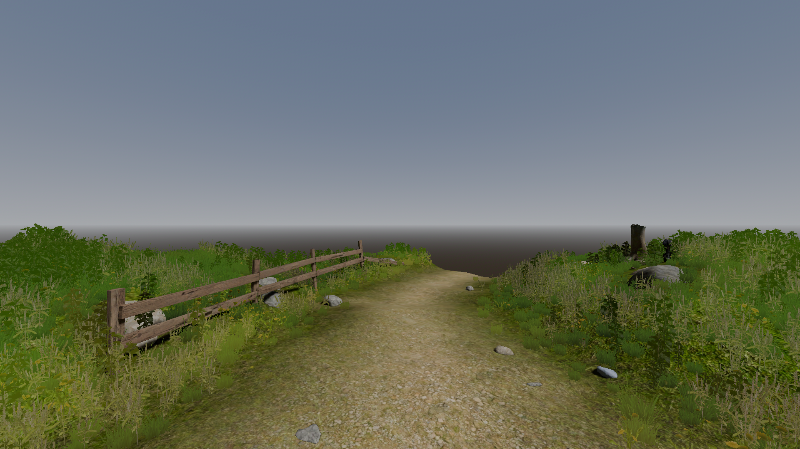
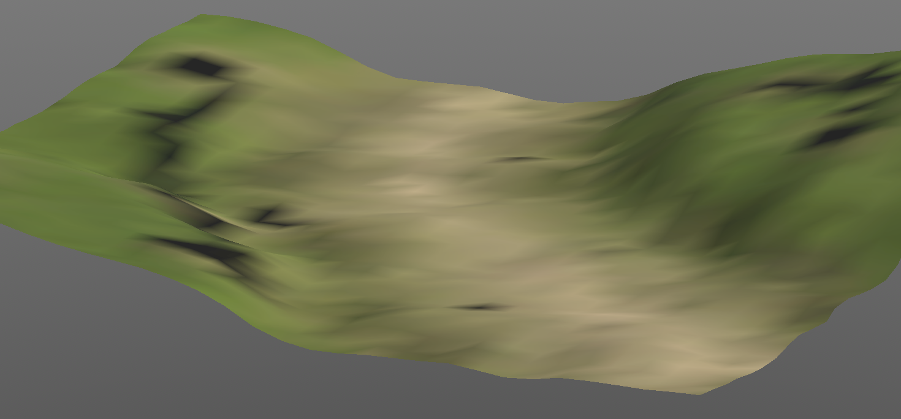
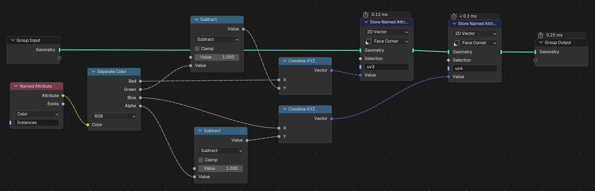

# Mobile Optimized Grass — Godot 4 Plugin

A 3D grass instancing plugin and shader designed for mobile GPUs and standalone XR devices.

## Why alpha-to-coverage?

Grass (and other ground-cover vegetation) is a recurring challenge in 3D graphics, especially on mobile platforms. A common approach is to take a simple cluster of intersecting grass cards and draw hundreds or thousands of instances. While efficient on desktop, alpha-blending the overlapping triangles causes massive overdraw that kills mobile performance.

Alpha test (alpha scissor) is cheaper but creates ugly aliasing, especially at distance — meshes can visibly disappear as LOD kicks in.

[Alpha to coverage](https://en.wikipedia.org/wiki/Alpha_to_coverage) solves both problems. It leverages MSAA — which is [cheap on mobile tile-based GPUs](https://developers.meta.com/horizon/documentation/unreal/gpu-improved-algorithms/#multi-sampled-anti-aliasing-msaa) — by converting the alpha value into a per-sample coverage mask. Each fragment is either fully drawn or fully discarded (no blending, no overdraw), yet the MSAA mask still smooths edges. In Godot's shading language this is `alpha_to_coverage_and_one`: the alpha channel drives the MSAA sample mask, then is clamped to 1, so there is zero blending overhead.

This plugin pairs `alpha_to_coverage_and_one` with the `unshaded` render mode for additional savings. Because there is no per-fragment lighting, the plugin fakes shadows by sampling nearby terrain vertex colors and tinting each grass instance accordingly.

## Features

- In-editor grass painter: paint density and shadow tint directly on the terrain mesh in the Godot 3D viewport — no Blender round-trip required.
- Up to four independent plant types (R/G/B/A density channels).
- Two scatter algorithms: stratified grid-jitter and Poisson disk blue-noise.
- Per-type `GrassTypeConfig` resources for per-channel shader overrides.
- Bake to a binary file for near-instant runtime loading — no scattering at startup in shipping builds.
- Optional Blender workflow: import pre-painted density and shadow data from UV3/UV4 vertex attributes.

## Installation

1. Copy `addons/mobile_optimized_grass/` into your project's `addons/` directory.
2. In Godot, open **Project → Project Settings → Plugins** and enable **Mobile Optimized Grass**.
3. Set **Rendering → Renderer → Rendering Method** to `mobile` and enable **MSAA 3D** (4× or 8× recommended) for alpha-to-coverage to work.

## Quick start

1. Add `addons/mobile_optimized_grass/mobile_optimized_grass.tscn` (or a `GrassInstancer` node) to your scene.
2. In the Inspector, assign `terrain_mesh_instance` — the `MeshInstance3D` that grass will grow on.
3. Assign a grass mesh to at least one of the four `type_meshes` slots.
4. Select the `GrassInstancer` node. The **Grass Painter** dock appears at the bottom of the editor.
5. Pick a channel (R/G/B/A), select the **Paint** tool, and drag across the terrain in the 3D viewport to paint density.
6. Click **Regenerate** in the dock to scatter instances according to the painted density.
7. Click **Bake** to serialize the instance data to disk. The baked file is loaded automatically at runtime.

## Grass Painter dock

The dock becomes active whenever a `GrassInstancer` node is selected.

### Channels

| Button | What it paints |
|--------|----------------|
| **R / G / B / A** | Density for plant types 0–3 (stored in `ARRAY_CUSTOM0`) |
| **Tint** | Per-vertex shadow tint color (stored in `ARRAY_COLOR`) |

Each plant-type channel has an editable label (e.g. "Grass", "Flowers") for your own reference.

### Tools

| Tool | Effect |
|------|--------|
| **Paint** | Adds density to the selected channel |
| **Erase** | Removes density |
| **Darken** | Darkens tint color toward black |
| **Lighten** | Lightens tint color toward white |
| **Blur** | Smooths density across the painted area |

When **Tint** is the active channel, **Paint** blends vertices toward the chosen tint color and **Erase** restores them toward white.

### Brush settings

- **Size** — radius in world units (0.1 – 10).
- **Strength** — amount applied per stroke frame (0 – 1).
- **Falloff** — `Constant` (flat), `Linear`, or `Smooth` (ease-in/out at the brush edge).

### Preview

Toggle **Vertex colors** to overlay the painted data on the terrain mesh in the 3D viewport.

- **Single** — displays the active density channel as a grayscale overlay.
- **Composite** — displays all four density channels as an RGBA composite.

The overlay uses `grass_preview.gdshader` and is stripped at runtime.

### Scatter settings

| Setting | Description |
|---------|-------------|
| **Instances** | Total instances to scatter across all four channels combined |
| **Mode** | `Stratified` or `Poisson Disk` (see below) |
| **Min dist** | Minimum distance between instances in Poisson Disk mode |
| **Power** | Density sharpening exponent — higher values concentrate instances on the most-painted areas |

#### Stratified scatter

Divides the terrain XZ extent into a jittered grid of cells. One candidate per cell is projected onto the mesh surface and accepted based on the painted density. Fast, predictable instance count, no strict minimum distance.

#### Poisson Disk scatter

Bridson's Poisson disk algorithm. Enforces **Min dist** between every pair of instances, giving blue-noise quality placement. Output count is not exact — the result is trimmed to the proportional channel count if it overshoots.

### Actions

| Button | Effect |
|--------|--------|
| **Regenerate** | Re-scatter all four channels using current density maps and scatter settings |
| **Bake** | Serialize current instance transforms, colors, and custom data to `baked_file_path` |
| **Reset RGBA** | Zero all four density channels (shows a confirmation dialog; undoable with Ctrl+Z) |

## Per-type configuration (`GrassTypeConfig`)

Create a `GrassTypeConfig` resource and assign it to `type_configs[i]` to override shader parameters per channel:

| Property | Default | Description |
|----------|---------|-------------|
| `alpha_scissor_threshold` | 0.5 | Alpha threshold fed to `ALPHA_SCISSOR_THRESHOLD` |
| `alpha_antialiasing_edge` | 0.4 | Soft-edge width fed to `ALPHA_ANTIALIASING_EDGE` |
| `override_blend_factor` | false | Enable to use this config's blend factor instead of the node's |
| `blend_factor` | 0.5 | Vertical gradient blend from grass texture toward instance tint color |
| `override_height_bounds` | false | Enable to use explicit height bounds instead of auto-computed ones |
| `min_height` / `max_height` | 0 / 1 | Mesh Y extent used by the shader gradient |

## Baking and runtime loading

Click **Bake** (dock) or check **Bake Instances** (Inspector) to write all instance data to `baked_file_path` (default `res://grass_instances.bin`). The binary file stores transforms, per-instance colors, and custom data for all four channels.

At runtime `_ready()` loads the baked file and populates the four `MultiMeshInstance3D` nodes immediately — no scattering runs in a shipping build. In the editor, if no baked file is found, scattering runs automatically so you can see the result while working.

The plugin strips `MultiMesh` instance data from the scene file on pre-save and restores it on post-save, keeping `.tscn` files small.

## Blender workflow (optional)

The in-editor painter is the easiest path. If you prefer to prepare data in Blender, the plugin still reads it:

### Shadow tint (vertex colors → `ARRAY_COLOR`)

Render combined lighting to the terrain mesh's vertex colors in Blender (Cycles bake → blur) to capture approximate shadow data. The plugin samples these colors at each instance position and passes them to the shader, which blends the terrain tint into the grass from the base upward.

Match Blender's light rotations to Godot's when baking: Blender's +Y axis is Godot's +Z axis.

### Density channels (UV3/UV4 → `ARRAY_CUSTOM0`)

Paint four density channels as additional vertex colors in Blender, then export them as `UV3` (R/G channels) and `UV4` (B/A channels). Godot imports this data as `ARRAY_CUSTOM0`, a `PackedFloat32Array` with four floats per vertex.

**Important:** When exporting UV data from Blender, invert the V axis on UV3 and UV4. Blender stores UV coordinates with V=0 at the top, but Godot expects V=0 at the bottom. Without this inversion, the density data will appear flipped along the Z axis.

Below is a simple Geometry Nodes workflow that illustrates the mapping between Blender's color attributes and Godot's custom data:

Export the mesh as a glTF file and make sure `Data > Mesh > Attributes` is checked, as well as `Data > Vertex Colors > Export All Vertex Colors`. Set `Data > Material > Materials` to "Placeholder" or else any existing texture materials will cause the vertex colors to be excluded.

All four channels are direct reads: `0.0` = no density, `1.0` = full density.

> **Migration note:** A previous version of this plugin applied a `1.0 -` inversion to the G and A channels to compensate for a Blender export artifact. This inversion has been removed. If you have a mesh prepared with the old workflow, its G and A channels will appear inverted in the painter. To fix: invert those channel values in Blender before re-exporting, or repaint them in the Godot painter.

## Performance notes

- The demo scene runs at 90 fps on Meta Quest 3. Reducing the grass mesh to two intersecting quads (instead of three) was needed for the large demo to hold frame rate.
- Use [Application SpaceWarp](https://developers.meta.com/horizon/blog/introducing-application-spacewarp/) on Quest to halve the required frame rate (target 45 fps instead of 90 fps), which allows significantly more instances.
- `unshaded` and `fog_disabled` / `shadows_disabled` / `ambient_light_disabled` render modes are all set in the shader for maximum fragment throughput.
- Bake before shipping — runtime scatter over a large mesh can take several frames.
